# Préambule

Le présent document a pour objectif de présenter synthétiquement - et au fur et
à mesure des séances - la solution du TD 1 correspondant au cours de Statistique
descriptive 2 dispensé en L2 MIASHS à l'Université Lumière Lyon 2 par [Stéphane CHRÉTIEN](https://sites.google.com/site/stephanegchretien/enseignement/l2-miashs-statistiques-descriptives/l2-statistiques-descriptives-2-regression-et-classification). Les consignes sont trouvables dans le répertoire `doc` ; `data` contient pour sa part les jeux de données utilisés dans le cadre du TD dans des formats simples d'usage.


*Ce document n'est pas un tutoriel pour R, et n'a pas pour but de remplacer le CM*.
Au-delà du cours, il est vivement recommandé de consulter la BU (et pas
uniquement dans cette matière !). Les ressources sont pour la plupart en français, et les ouvrages sont quant à eux tous disponibles à la BU (ou sur internet dans le cas d'un livre). Mes recommandations portent sur des livres que j'estime être de bonne qualité et que j'ai parfois moi-même utilisé lorsque j'étais étudiant (et que j'utilise toujours), mais il se peut que celles-ci ne soient pas adaptées à tout le monde. Le cas échéant, je vous invite à vous constituer votre propre base documentaire : il n'y a que vous qui pouvez savoir quelle présentation vous convient ! De mon point de vue, il est même plutôt sain de se constituer ses propres outils et références. Aucune obligation, juste de la recommandation, donc.

# Ressources utiles
## Ouvrages
- BOURBONNAIS, Régis. Économétrie. Chez Dunod.
- GOLDFARB, Bernard et PARDOUX, Catherine. Introduction à la méthode statistique - statistique et probabilités. Chez Dunod.
- HURLIN, Christophe et MIGNON, Valérie. Statistique et probabilités en économie-gestion. Chez Dunod.
- BERTRAND, Frédéric et MAUMY-BERTRAND, Myriam. Initiation à la statistique avec R. Chez Dunod.
- GOULET, Vincent. Introduction à la programmation en R. [Ebook gratuit disponible sur le CRAN.](https://cran.r-project.org/doc/contrib/Goulet_introduction_programmation_R.pdf)

## Ressources hors ouvrages pour R
- [Ressources de Stéphane CHRÉTIEN](https://sites.google.com/site/stephanegchretien/enseignement/logiciel-r-pour-les-statistiques)
- [Tutoriel de Sébastien DÉJEAN](http://www.math.univ-toulouse.fr/~sdejean/PDF/semin-R_juin_2014.pdf)
- [Ressources de Ricco RAKOTOMALALA](http://eric.univ-lyon2.fr/~ricco/cours/cours_programmation_R.html)

## Ressources internet bonus
- [Three simple things about regression that every data scientist should know](https://towardsdatascience.com/three-simple-things-about-regression-that-every-data-scientist-should-know-b3419ce3ae3c)
- [A Big Problem with Linear Regression and How to Solve It](https://towardsdatascience.com/robust-regression-23b633e5d6a5)
- [La Statistique expliquée à mon chat](https://www.youtube.com/channel/UCWty1tzwZW_ZNSp5GVGteaA) et le [Chat Sceptique](https://www.youtube.com/c/chatsceptique) (chaînes Youtube du même auteur)
- [Seeing theory](https://seeing-theory.brown.edu/) (site web interactif sur les probabilités)

# Exercices

## Exercice 1

Ce premier exercice constitue un pied à l'étrier pour la pratique de la régression
linéaire simple (et par conséquent, de la régression linéaire multiple). Tous les détails
sur les formules, etc. sont donnés ici, avec les interprétations adéquates. Les autres
exercices seront corrigés de manière bien plus succinte, nous irons droit au but sauf
lorsque des approfondissements seront nécessaires car les détails n'auront pas été vus sur
l'exercice 1. Peu importe que les formules ne soient pas détaillées sur la suite du TD:
il vous suffira de reprendre l'exercice 1, et d'adapter le code à votre nouveau cas. Il y
a de toutes façons assez peu à savoir en termes de code. Ce n'est pas la programmation qui
est ici au cœur des enjeux, mais bien la compréhension de la méthode et comment interpréter
les indicateurs.

Commençons par le commencement : charger les données.

```r
# Méthode 1 : saisie manuelle
age <- c(3, 4, 5, 6, 7, 8, 9, 10, 11, 12)
taille <- c(96, 104.8, 110.3, 115.3, 121.9, 127.4, 130.8, 136, 139.7, 144.5)
# Si l'on veut un dataframe : 
df_ex1 <- data.frame(cbind(age, taille))

# Méthode 2 : chargement d'un csv
df_ex1 <- read.csv("data/Exercice1.csv")

# Lorsque l'on dispose d'un dataframe, on peut accéder aux variables (1 variable
# par colonne) en suffixant le nom du dataframe avec un $. On n'est pas obligé
# de créer de nouvelles variables : c'est juste pour l'exemple !
age <- df_ex1$age
taille <- df_ex1$taille
```


En R, l'usage veut que l'on utilise une flèche pour l'affectation d'une valeur
à une variable, et que l'on utilise le signe `=` pour les paramètres d'une fonction.
Pour rester conformes aux conventions, on utilisera la flèche (il existe un raccourci
clavier pour la faire facilement : c'est la combinaison Alt + -).

Nos données sont bien en mémoire ; nous allons pouvoir les représenter. Nous cherchons à représenter notre taille en fonction de l'âge, aussi, notre X est l'âge et notre Y est la taille, qui sont toutes deux des variables continues. En fait, on veut capturer la relation entre ces deux variables, c'est-à-dire expliquer Y grâce à X. Pour rendre les choses plus claires par rapport aux formules du cours et au code, on renommera nos variables en X et en Y puis on les représentera.


```r
# Je recommande l'usage de majuscules parce que nous manipulons ici des vecteurs
X <- df_ex1$age
Y <- df_ex1$taille

plot(X, Y)
```

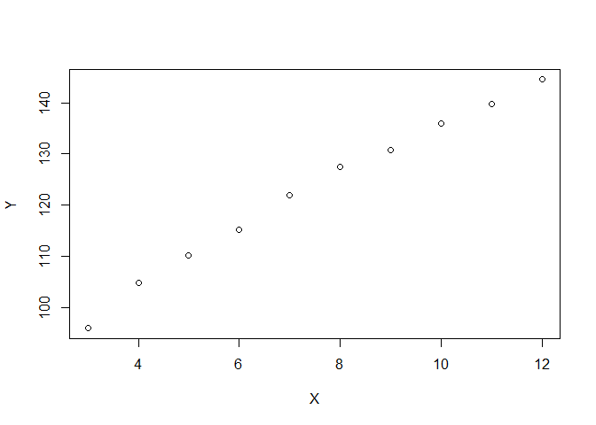<!-- -->

Si l'on devait synthétiser le nuage de points, une droite semble adaptée au regard de sa forme.
On va donc utiliser le modèle linéaire *simple*. Visualiser est important pour
se forger des intuitions, et ce n'est pas parce que l'on a des indicateurs
identiques sur deux jeux de données distincts que le même modèle est adapté ;
j'en veux pour exemple le [quartet d'Anscombe](https://fr.wikipedia.org/wiki/Quartet_d%27Anscombe).

Comme toujours avec un modèle, utiliser la régression linéaire simple, c'est
faire un certain nombre d'hypothèses sur nos données. Dans le cadre de ce cours,
nous ne mettrons l'accent que sur deux : l'indépendance de tous les couples
(x,y) et le fait que Y suive une loi normale. Ceux/celles qui liront le
BOURBONNAIS en sauront davantage.

Mais est-ce bien vrai ? C'est à nous de le vérifier, et du reste, pas toujours. Dans les faits, un statisticien doit souvent composer avec des violations d'hypothèse ([multicolinéarité dans le cas de la régression linéaire multiple](https://larmarange.github.io/analyse-R/multicolinearite.html), etc.). Cela ne rend pas un modèle inutile pour autant : le modèle n'est qu'un outil, à nous de sélectionner le bon en fonction de notre cas à traiter. En bref, ce n'est pas parce que l'on dispose d'un marteau qu'il faut voir des clous de partout ! De plus, on peut plus ou moins toujours faire mieux. Par exemple, on cherche ici à modéliser la taille ; or, la loi normale peut théoriquement prendre des valeurs négatives. On pourrait opter pour une [gaussienne tronquée](https://fr.wikipedia.org/wiki/Loi_tronqu%C3%A9e#Loi_normale_tronqu%C3%A9e) de telle sorte à éliminer les valeurs négatives par exemple. Pour l'heure, restons dans la simplicité de notre modèle d'intérêt.

Si l'on devait faire les choses de manière très directe dans R, alors on ferait ainsi :


```r
model <- lm(Y ~ X)
plot(X, Y)
abline(model)
```

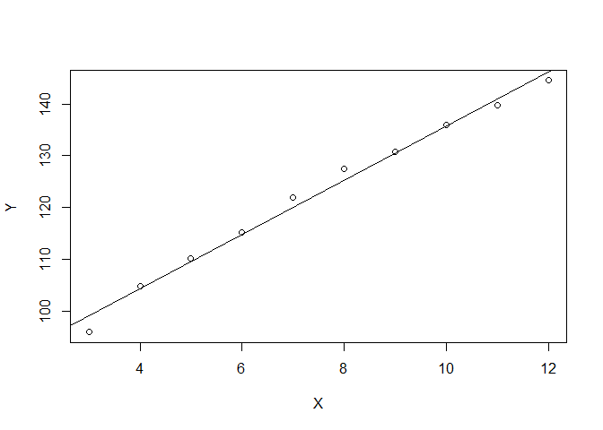<!-- -->

R fait les choses pour nous ; très pratique. Voyez plutôt :


```r
summary(model)
```

```
## 
## Call:
## lm(formula = Y ~ X)
## 
## Residuals:
##    Min     1Q Median     3Q    Max 
## -3.180 -0.860  0.350  0.625  2.120 
## 
## Coefficients:
##             Estimate Std. Error t value Pr(>|t|)    
## (Intercept)  83.5200     1.5086   55.36 1.26e-11 ***
## X             5.2200     0.1878   27.79 3.03e-09 ***
## ---
## Signif. codes:  0 '***' 0.001 '**' 0.01 '*' 0.05 '.' 0.1 ' ' 1
## 
## Residual standard error: 1.706 on 8 degrees of freedom
## Multiple R-squared:  0.9897,	Adjusted R-squared:  0.9885 
## F-statistic: 772.2 on 1 and 8 DF,  p-value: 3.035e-09
```

On peut lire que l'on a une ordonnée à l'origine de 83.52, et un coefficient directeur de la droite de 5.22. R nous donne même d'autres indications très intéressantes mais qui sortent du cadre de ce cours (rien ne vous interdit de demander ceci étant dit). Il y a quand même les coefs de significativité et le Rˆ2 (calcul détaillé ci-dessous). Funny fact mnémotechnique : avez-vous remarqué la façon dont on spécifie un modèle en termes de code ? Pour rappel : `lm(Y ~ X)`. Le tilde (`~`) est exactement le même que dans le langage classique des probabilités, on peut lire que Y suit la loi de X. Cela rappelle *un peu* nos hypothèses de base (Y suivant une gaussienne dont l'espérance est un modèle linéaire de X). C'est cela qui fait le charme de R : il s'agit ici d'un langage fait par des statisticiens, pour des statisticiens. On peut quand même faire des choses classiques avec R, dont des [applications web](https://shiny.rstudio.com/), mais l'intérêt est vite réduit à peau de chagrin lorsque l'on sort de choses sans rapport avec l'analyse de données. Avis aux MIASHS qui auront à fournir un
mémoire d'initiation à la recherche en L3...

Tout cela est très bien, mais on aimerait comprendre ; voyons comment calculer les coefficients à partir des formules du cours. On le fera de plusieurs façons tout à fait équivalentes du point de vue du résultat, l'idée étant de faire comprendre quel est le fonctionnement de ces formules. On nommera respectivement `a_hat` (a chapeau) le coefficient directeur de la droite, et `b_hat` (b chapeau) l'ordonnée à l'origine. En Statistique, l'usage veut que l'on mette un chapeau sur la notation de ce que l'on estime. **En d'autres termes, nos coefficients sont des estimations**.


```r
# Méthode 1 : version "je suis un statisticien"
a_hat_methode1 <- cov(X, Y) / var(X) 
# var est l'estimateur de la variance *sans biais*, on parle de correction
# de Bessel, mais vous verrez cela en Statistique inférentielle
b_hat_methode1 <- mean(Y) - a_hat_methode1 * mean(X)
# mean(Y) est y avec une barre

# Méthode 2: version "je me rends compte que je manipule des moyennes"
numerator <- mean((X - mean(X)) * (Y - mean(Y)))
# Ici, X - mean(X) signifie que pour toute valeur du vecteur X - et donc
# tout petit x, ou x indice i -, on va soustraire la valeur de la moyenne de X
denominator <- mean((X - mean(X)) ** 2)

a_hat_methode2 <- numerator / denominator
b_hat_methode2 <- mean(Y) - a_hat_methode2 * mean(X)

# Méthode 3: version "je suis un informaticien, j'aime les boucles"
# Cette version est de loin la plus explicite, mais je la déconseille en
# pratique.
n <- nrow(df_ex1) # Nombre d'individus statistiques, ou de mesures en l'occurrence

numerator <- 0
denominator <- 0
for (i in 1:n) {
  numerator <- numerator + (X[i] - mean(X)) * (Y[i] - mean(Y)) / n
  denominator <- denominator + ((X[i] - mean(X)) ** 2) / n
}
a_hat_methode3 <- numerator / denominator
b_hat_methode3 <- mean(Y) - a_hat_methode3 * mean(X)
```

Vérifiez par vous-mêmes : les valeurs sont les mêmes. Ici encore, avez-vous
remarqué comment on calcule le coefficient directeur sur la méthode 1 ? On fait
un ratio entre la covariance des deux variables et la variance de X. Intuitivement
parlant, c'est là où l'on voit que l'on cherche à expliquer Y à partir de X.

Par contre, il nous manquera quelque chose : les résidus. Ils sont importants,
puisque grossièrement, ils mesurent l'erreur de spécification, de mesure, etc.
C'est en quelque sorte eux qui font le lien entre un modèle linéaire simple
théoriquement parfait, et nos données réellement imparfaites. R le fait aussi
pour nous :


```r
model$residuals
```

```
##     1     2     3     4     5     6     7     8     9    10 
## -3.18  0.40  0.68  0.46  1.84  2.12  0.30  0.28 -1.24 -1.66
```

Mais ici encore, on cherche à comprendre. On va coller à la formule du cours :


```r
Y_hat <- predict(model) # On demande la valeur des Y estimés selon notre modèle
Epsilon <- Y - Y_hat # On soustrait les valeurs estimées aux valeurs réelles
```


```r
Epsilon
```

```
##     1     2     3     4     5     6     7     8     9    10 
## -3.18  0.40  0.68  0.46  1.84  2.12  0.30  0.28 -1.24 -1.66
```

Représentons maintenant les résidus :


```r
plot(model$residuals)
```

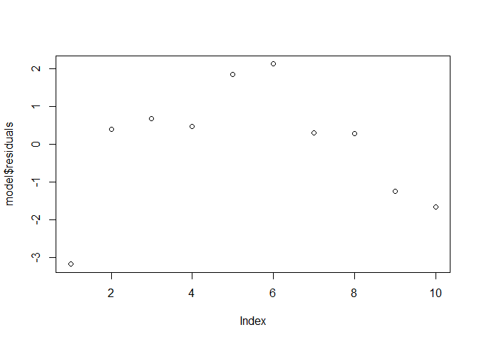<!-- -->

*A priori*, les résidus ne semblent pas vraiment s'annuler les uns les autres. Mais en fait, l'une des hypothèses fondamentales de la régression linéaire simple est que l'espérance des résidus est nulle (au passage, j'insiste : vous devriez vraiment lire le BOURBONNAIS en bibliographie). Regardons la moyenne de ces résidus :


```r
mean(model$residuals)
```

```
## [1] 4.436555e-17
```

Et on y est bien, on a des résidus proches de 0 (mais pas égaux pour des raisons liées au fait que l'on travaille avec un ordinateur).

Bien. Nous avons un modèle, mais encore faut-il savoir s'il vaut quelque chose au regard de nos données. Pour cela, on va calculer le R^2 (`R_sq`, pour "R square"), toujours en collant aux formules du cours.


```r
# Attention au moment où l'on met les termes au carré, il ne faut pas se tromper entre avant et après les parenthèses de la fonction pour faire la somme.
SCR <- sum(model$residuals ^ 2)
SCT <- sum((Y-mean(Y)) ^ 2)

R_sq <- 1 - SCR/SCT
```

Et voilà ! La sortie de R nous donnait bien le même résultat. Pour le principe, on va aussi faire le R^2 ajusté (`R_sq_adj`).


```r
# Attention au moment où l'on met les termes au carré, il ne faut pas se tromper entre avant et après les parenthèses de la fonction pour faire la somme.
SCR <- sum(model$residuals ^ 2)
SCT <- sum((Y-mean(Y)) ^ 2)

# Il nous faudra en plus le nombre de mesures et le nombre de variables
n <- nrow(df_ex1)
p <- 1 # La régression linéaire simple n'inclut qu'une seule variable.

numerator <- SCR / (n - p - 1)
denominator <- SCT / (n - 1)
R_sq_adj <- 1 - numerator / denominator
```

Évidemment, tant le R^2 que sa variante ajustée sont outrageusement hauts, très proches de 1. Autant vous dire que vous ne verrez pas souvent ce genre de situation en pratique. Ne paniquez donc pas si vous n'obtenez rien de bon sur certains jeux de données : cela veut probablement dire que votre modélisation n'est pas bonne c'est-à-dire que soit la régression linéaire simple (ou autre modèle...) est insuffisante, soit qu'il va falloir revoir les variables du modèle, soit les deux. Cela peut aussi être dû à des soucis de données. L'histoire du marteau et des clous, encore une fois.

### Bonus
Pour des raisons pédagogiques, on traite ici des données dont il est évident qu'elles peuvent être modélisées, synthétisées facilement avec un modèle linéaire simple. Mettons un peu de sel dans tout cela, afin de mieux comprendre ce qu'il se passe : vous pouvez simuler vous-mêmes vos données pour jouer un peu avec le modèle. On peut le faire avec R, en utilisant des générateurs, ou alors de façon plus ludique en dessinant ses nuages de points à la souris. RDV sur [drawdata.xyz](https://drawdata.xyz/#scatterchart), section scatterchart. Dessinez vos nuages, téléchargez vos CSV, puis répétez les étapes ci-dessus. On peut aussi créer des types/groupes de données, pour faire plus complexe. Le site permet aussi de dessiner des histogrammes, qui "peuvent être vus comme une version discontinue empirique de la courbe de densité d'une variable
aléatoire" (*dixit* [Julien JACQUES](http://eric.univ-lyon2.fr/~jjacques/Download/Cours/SI-Cours.pdf)). En gros, dessiner un histogramme vous permet de créer vos propres distributions facilement (et ce n'est pas grave que cela ne colle pas à une distribution théorique, c'est même une bonne chose en termes d'apprentissage). Essayez donc de faire
des choses qui ne ressemblent pas à des gaussiennes, pour voir ce que cela donne. À noter que notre site [drawdata.xyz](https://drawdata.xyz) pourra nous servir pour toutes les notions du cours. À garder sous le coude, donc !

## Exercice 2


```r
df_ex2 <- read.csv("data/Exercice2.csv")
X <- df_ex2$Taux.d.urbanisation
Y <- df_ex2$Taux.de.natalité
model <- lm(Y ~ X)
summary(model)
```

```
## 
## Call:
## lm(formula = Y ~ X)
## 
## Residuals:
##      Min       1Q   Median       3Q      Max 
## -15.6782  -3.7413   0.5601   4.6440  12.5772 
## 
## Coefficients:
##             Estimate Std. Error t value Pr(>|t|)    
## (Intercept)  42.9905     4.8454   8.872 1.28e-06 ***
## X            -0.3989     0.1453  -2.746   0.0177 *  
## ---
## Signif. codes:  0 '***' 0.001 '**' 0.01 '*' 0.05 '.' 0.1 ' ' 1
## 
## Residual standard error: 8.154 on 12 degrees of freedom
## Multiple R-squared:  0.3859,	Adjusted R-squared:  0.3347 
## F-statistic:  7.54 on 1 and 12 DF,  p-value: 0.01774
```

En regardant le R^2, on ne peut pas conclure que la modélisation soit bonne. Notre X ne suffit pas à expliquer
notre Y. **Cela ne signifie pas systématiquement** :

- que la relation n'est pas linéaire : peut-être qu'il suffit d'ajouter d'autres variables pour expliquer notre phénomène ;

- que la relation est inexistante : peut-être que la relation n'est tout simplement pas linéaire.

On ne peut juste pas conclure autrement avec les éléments que nous avons à disposition.


```r
plot(X, Y)
abline(model)
```

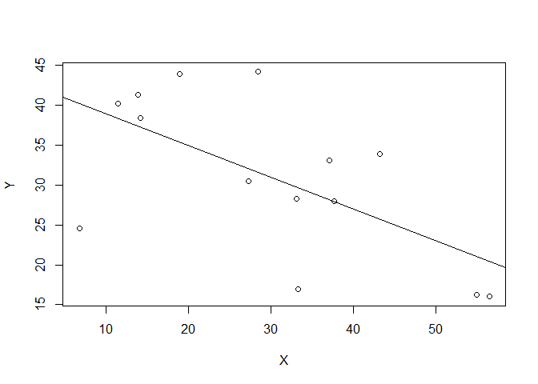<!-- -->

## Exercice 3


```r
# L'option header permet de dire que la première ligne est le titre des colonnes.
# Elle est ici mise sur TRUE.
ozone <- read.table("data/ozone.txt", header = T)
plot(maxO3 ~ T12, data = ozone)
```

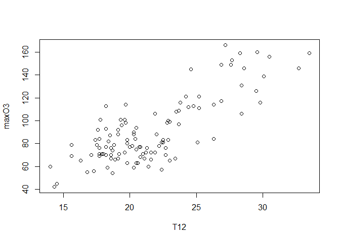<!-- -->

Visuellement, une régression linéaire simple semble être une option. Voyons cela en pratique.


```r
reg <- lm(maxO3 ~ T12, data = ozone)
summary(reg)
```

```
## 
## Call:
## lm(formula = maxO3 ~ T12, data = ozone)
## 
## Residuals:
##     Min      1Q  Median      3Q     Max 
## -38.079 -12.735   0.257  11.003  44.671 
## 
## Coefficients:
##             Estimate Std. Error t value Pr(>|t|)    
## (Intercept) -27.4196     9.0335  -3.035    0.003 ** 
## T12           5.4687     0.4125  13.258   <2e-16 ***
## ---
## Signif. codes:  0 '***' 0.001 '**' 0.01 '*' 0.05 '.' 0.1 ' ' 1
## 
## Residual standard error: 17.57 on 110 degrees of freedom
## Multiple R-squared:  0.6151,	Adjusted R-squared:  0.6116 
## F-statistic: 175.8 on 1 and 110 DF,  p-value: < 2.2e-16
```


```r
plot(maxO3 ~ T12, data = ozone)
T12 <- seq(min(ozone[,"T12"]), max(ozone[,"T12"]), length = 100)
grille <- data.frame(T12)
ICdte <- predict(reg, new = grille, interval = "confidence", level = 0.95)
matlines(grille$T12, cbind(ICdte), lty = c(1,2,2), col = 1)
```

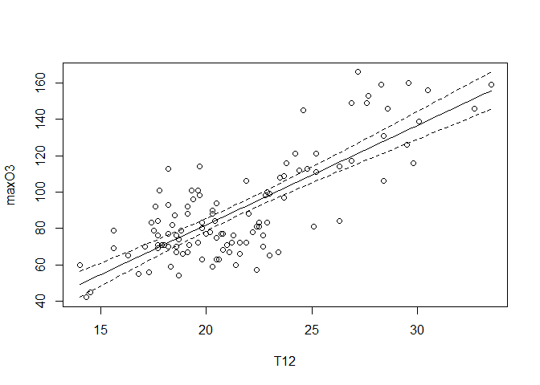<!-- -->

Plus l'on va en direction des infinis, plus l'intervalle de confiance s'élargit (on va dire que c'est un "effet trompette" pour le mnémotechnique, mais ne mettez pas cela dans vos copies). Concrètement, cela signifie que l'incertitude sur notre valeur moyenne augmente au fur et à mesure que l'on va vers les infinis.


```r
plot(reg$residuals)
```

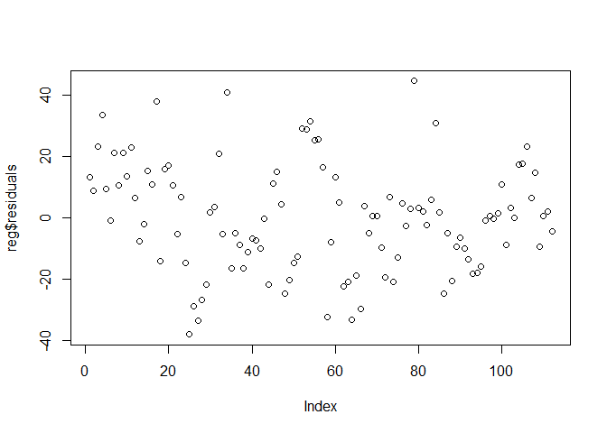<!-- -->


```r
plot(maxO3 ~ T12, data = ozone)
T12 <- seq(min(ozone[,"T12"]), max(ozone[,"T12"]), length = 100)
grille <- data.frame(T12)
ICprev <- predict(reg, new = grille, interval = "pred", level = 0.95)
matlines(grille$T12, cbind(ICprev), lty = c(1,2,2), col = 1)
```

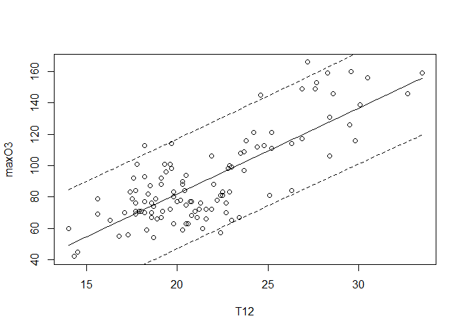<!-- -->

Cela signifie qu'en moyenne, pour une valeur que l'on cherche à prédire, on devrait tomber dans l'intervalle délimité par les lignes en pointillés. En fait, avec notre approche, on cherche à prédire une moyenne plutôt qu'une valeur précise, et c'est d'ailleurs exprimé par le fait que Y suive une gaussienne dont le premier paramètre est un modèle linéaire de X.


**Pour toutes ces questions d'intervalles, je vous invite à vous référer à [cet article](https://towardsdatascience.com/three-simple-things-about-regression-that-every-data-scientist-should-know-b3419ce3ae3c) en particulier.**

### Bonus sur les résidus

Dans le cours et dans l'article référencé ci-dessus, on parle du fait que l'erreur (ou résidus) est souvent gaussienne. Dans le bonus de l'exercice 1, j'ai expliqué qu'un histogramme est en quelque sorte une version approximative d'une densité. La preuve en image :


```r
# Histogramme des résidus
hist(reg$residuals, freq = F)

# Gaussienne paramétrisée par la moyenne et l'écart-type (corrigé) des résidus
# (en rouge sur le graphique)
curve(dnorm(x, mean = mean(reg$residuals), sd = sd(reg$residuals)), 
      col="red", lwd=2, add=TRUE, yaxt="n")
```

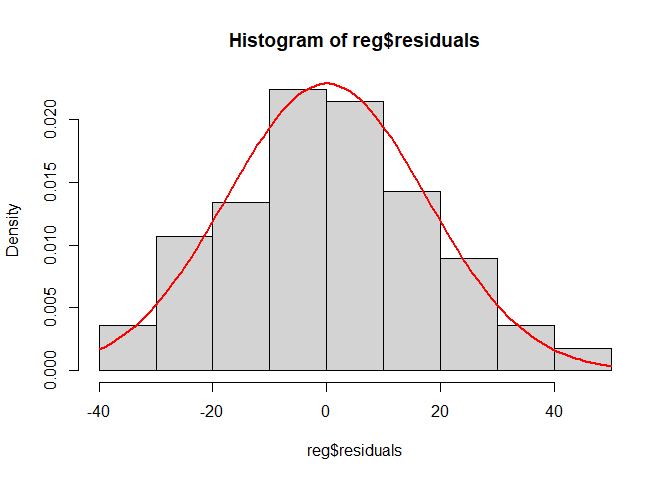<!-- -->

Vous verrez cela en Statistique inférentielle, mais pour ceux qui y tiendraient réellement, on peut tester la normalité avec un
[test de Shapiro-Wilk](https://en.wikipedia.org/wiki/Shapiro%E2%80%93Wilk_test#Interpretation) par exemple :


```r
shapiro.test(reg$residuals)
```

```
## 
## 	Shapiro-Wilk normality test
## 
## data:  reg$residuals
## W = 0.99235, p-value = 0.792
```

On peut conclure du test que l'hypothèse de normalité des données (ici, les résidus) ne peut être rejetée.

## Exercice 4


```r
# Dans notre fichier, le séparateur est le point-virgule, d'où le paramètre sep.
df_ex4 <- read.table("data/eucalyptus.txt", header = T, sep = ";")
X <- df_ex4$circ
Y <- df_ex4$ht
plot(X, Y)
```

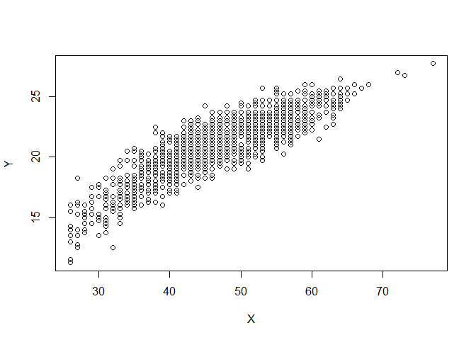<!-- -->

Visuellement, un modèle linéaire simple semble adapté. Allons-y:


```r
model <- lm(Y ~ X)
summary(model)
```

```
## 
## Call:
## lm(formula = Y ~ X)
## 
## Residuals:
##     Min      1Q  Median      3Q     Max 
## -4.7659 -0.7802  0.0557  0.8271  3.6913 
## 
## Coefficients:
##             Estimate Std. Error t value Pr(>|t|)    
## (Intercept) 9.037476   0.179802   50.26   <2e-16 ***
## X           0.257138   0.003738   68.79   <2e-16 ***
## ---
## Signif. codes:  0 '***' 0.001 '**' 0.01 '*' 0.05 '.' 0.1 ' ' 1
## 
## Residual standard error: 1.199 on 1427 degrees of freedom
## Multiple R-squared:  0.7683,	Adjusted R-squared:  0.7682 
## F-statistic:  4732 on 1 and 1427 DF,  p-value: < 2.2e-16
```

On peut dire que le modèle est plutôt bon au regard des indicateurs.


```r
plot(X, Y)
abline(model)
```

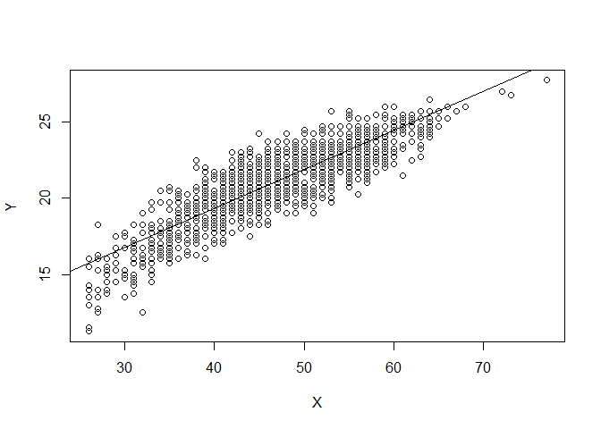<!-- -->

## Exercice 5

** Lisez tout avant de vous lancer **

En fait, ce n'est pas vraiment un exercice comme ci-dessus, mais cela reste intéressant, réaliste et en lien avec l'actualité. En plus c'est une application un peu SHS. Pour vous faciliter la vie, j'ai inclus le jeu de données dans le dossier `data`.

Suivez les indications du site, SAUF les instructions suivantes, qui ne fonctionneront pas:

```
library("rprojroot")
root<-has_file(".ROS-Examples-root")$make_fix_file()
```

Il faudra aussi que vous installiez les packages indiqués dans la cellule "load packages". L'instruction pour les installer est `install.packages()`.

Pour charger les données, cela se passe ainsi :


```r
hibbs <- read.table("data/hibbs.dat", header = T)
```

Bon courage !
